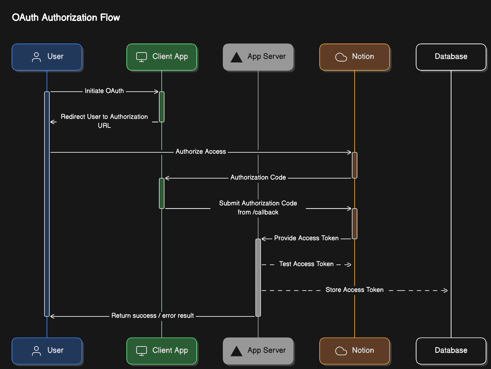

# Demo de OAuth de Notion

[English](README.md) · **Español**

Este es un ejemplo de cómo usar la API de Notion para autenticar a un usuario y obtener sus datos, listo para ser desplegado en Vercel. Implementa el flujo de OAuth de Notion, que está documentado [aquí](https://developers.notion.com/docs/authorization#public-integration-auth-flow-set-up).

## Variables de Entorno

- `OAUTH_CLIENT_ID`: El ID de cliente de la integración de Notion.
- `OAUTH_CLIENT_SECRET`: El secreto de cliente de la integración de Notion.
- `OAUTH_REDIRECT_URI`: La URI de redireccionamiento de la integración de Notion.
- `NEXT_PUBLIC_NOTION_AUTH_URL`: La URL de autorización de la integración de Notion.
- `NOTION_DATABASE_ID`: El ID de la base de datos de la que deseas obtener datos (si quieres probar el token).
- `NOTION_VERSION`: La versión de la API de Notion que deseas usar (si quieres probar el token). Puedes encontrar la última versión [aquí](https://developers.notion.com/reference/versioning).

## Configuración

1. Clona el repositorio. Instala las dependencias con `npm install`.
2. Crea una nueva integración [aquí](https://www.notion.so/my-integrations). Opcionalmente, agrega una plantilla a la integración ([guía](https://developers.notion.com/docs/authorization#prompt-for-an-integration-with-a-notion-template-option)) para que los usuarios la importen cuando se conecten a tu integración.
3. Agrega un archivo `.env.local` a tu proyecto y añade `OAUTH_CLIENT_ID` y `OAUTH_CLIENT_SECRET` al archivo.
4. Notion requiere que uses HTTPS para la URI de redireccionamiento. Para probar el flujo de OAuth localmente, puedes usar [ngrok](https://ngrok.com/) para crear una URL HTTPS temporal y gratuita para tu entorno de desarrollo local.
5. Configura la URI de redireccionamiento para tu integración de Notion como `https://<your-ngrok-subdomain>.ngrok.io/callback`. Almacena la URL en la variable de entorno `OAUTH_REDIRECT_URI`.
6. Copia la URL de autorización desde la página de la integración y configúrala como la variable de entorno `NEXT_PUBLIC_NOTION_AUTH_URL`.
7. Si deseas probar el token, crea una nueva base de datos en tu espacio de trabajo de Notion, copia el ID de la base de datos y configúralo como la variable de entorno `NOTION_DATABASE_ID`. Esta [guía](https://developers.notion.com/reference/retrieve-a-database) explica dónde encontrar el ID de la base de datos. Establece `NOTION_VERSION` en la última versión [aquí](https://developers.notion.com/reference/versioning).
8. Usa el comando `npm run dev` para iniciar el servidor de desarrollo y `ngrok http --domain=<your-ngrok-domain>.ngrok.app 3000` para iniciar ngrok.
9. Haz clic en el botón "Connect" para probar el flujo de OAuth.
10. Una vez que tu integración esté funcionando, puedes desplegarla en Vercel usando el botón anterior. Esta [guía](https://vercel.com/docs/projects/environment-variables#declare-an-environment-variable) explica cómo configurar tus variables de entorno.

## Proceso

