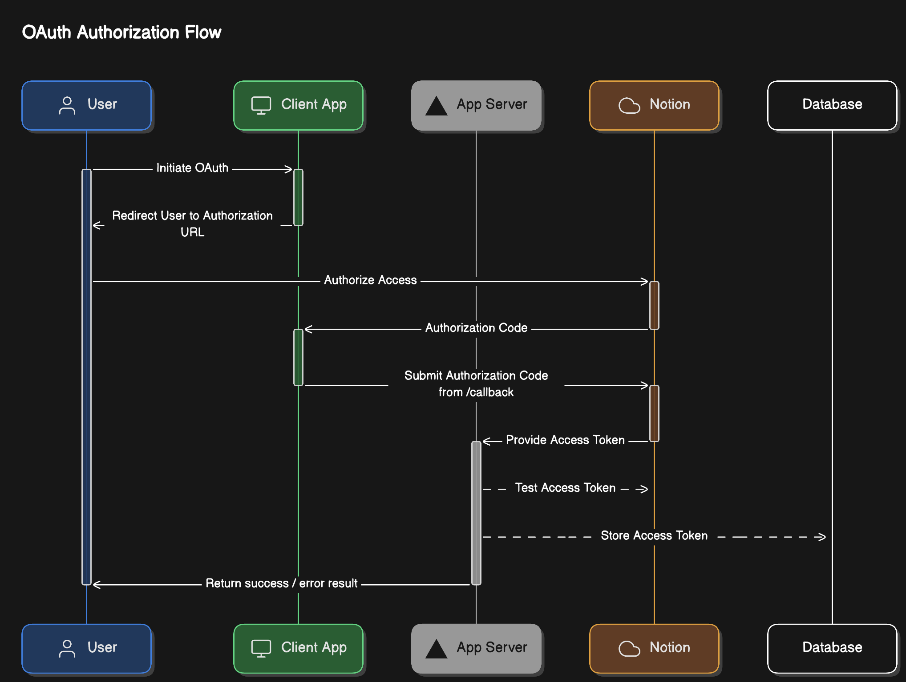

# Notion OAuth Demo

This is a example of how to use the Notion API to authenticate a user and fetch their data, ready to be deployed to Vercel. It implements the OAuth flow from Notion which is documented [here](https://developers.notion.com/docs/authorization#public-integration-auth-flow-set-up).

## Environment Variables

- `OAUTH_CLIENT_ID`: The client ID from the Notion integration.
- `OAUTH_CLIENT_SECRET`: The client secret from the Notion integration.
- `OAUTH_REDIRECT_URI`: The redirect URI from the Notion integration.
- `NEXT_PUBLIC_NOTION_AUTH_URL`: The authorization URL from the Notion integration.
- `NOTION_DATABASE_ID`: The ID of the database you want to fetch data from (if you want to test the token).
- `NOTION_VERSION`: The version of the Notion API to use (if you want to test the token). You can find the latest version [here](https://developers.notion.com/reference/versioning).

## Setup

1. Clone the repo. Install dependencies with `npm install`.
2. Create a new integration [here](https://www.notion.so/my-integrations). Optionally add a template to the integration([guide](https://developers.notion.com/docs/authorization#prompt-for-an-integration-with-a-notion-template-option)), for users to import when they connect to your integration.
3. Add an `.env.local` file to your project and add `OAUTH_CLIENT_ID` and `OAUTH_CLIENT_SECRET` to the file.
4. Notion requires that you use HTTPS for the redirect URI. To test the OAuth flow locally, you can use [ngrok](https://ngrok.com/) to create a free temporary HTTPS URL for your local development environment.
5. Set the Redirect URI for your Notion integration to `https://<your-ngrok-subdomain>.ngrok.io/callback`. Store the URL in the `OAUTH_REDIRECT_URI` environment variable.
6. Copy the authorization URL from the integration page and set it as the `NEXT_PUBLIC_NOTION_AUTH_URL` environment variable.
7. If you want to test the token, create a new database in your Notion workspace, copy the database ID and set it as the `NOTION_DATABASE_ID` environment variable. This [guide](https://developers.notion.com/reference/retrieve-a-database) explains where to find the database ID. Set the `NOTION_VERSION` to the latest version [here](https://developers.notion.com/reference/versioning).
8. Use the `npm run dev` command to start the development server and `ngrok http --domain=<your-ngrok-domain>.ngrok.app 3000` to start ngrok.
9. Click the "Connect" button to test the OAuth flow.
10. Once your integration is working, you can deploy it to Vercel using the button above. This [guide](https://vercel.com/docs/projects/environment-variables#declare-an-environment-variable) explains how to set your environment variables.

## Process

